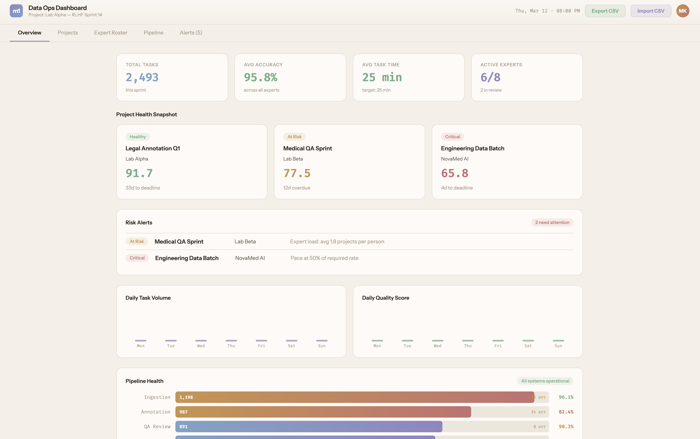
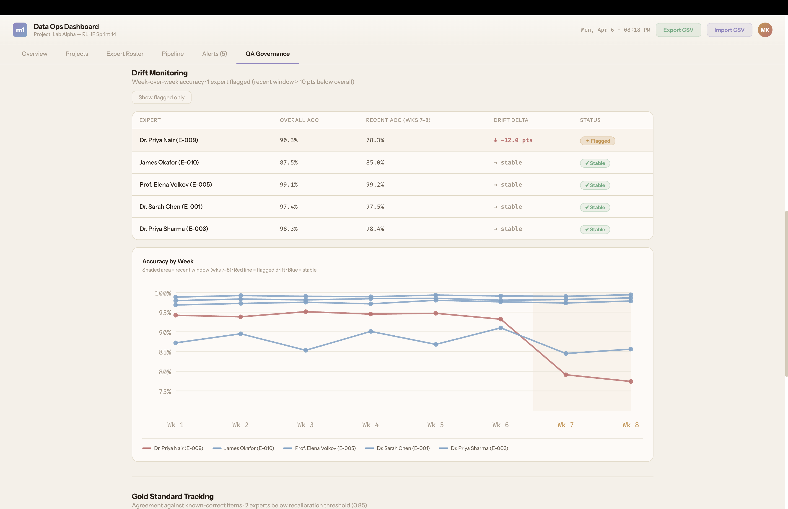

# micro1 SPL Dashboard

A working demo of a data operations command center for managing AI training data projects at scale.

At companies like micro1, a Strategic Projects Lead coordinates teams of hundreds of domain experts (PhDs, lawyers, doctors, and professors) who produce the labeled data that frontier AI labs use to train their models. The SPL owns quality, delivery, and expert performance across multiple simultaneous client projects. This dashboard is built for that role: a decision-support surface that surfaces "this project is going to miss" before it misses, with enough context to act.





---

## How to run it

1. Download or clone this repo
2. Open `preview.html` in any browser

No npm. No build step. No setup. It runs immediately.

---

## What this demonstrates

- **Outcome-first health scoring.** A composite health score (pace 40% + quality 40% + expert load 20%) weights the inputs that actually predict delivery failure. Pace and quality are the primary signals; load is a leading indicator surfaced separately so the SPL can interrogate each component rather than trust a single number.

- **Risk visibility at the right layer of abstraction.** The Risk Alerts panel identifies the single largest contributing gap (pace, quality, or load) and states it in plain language. The SPL sees what to fix, not just that something is wrong.

- **QA governance that catches what overall averages hide.** An expert at 91% overall accuracy can still be drifting badly in recent weeks. An expert at 88% overall can still be systematically miscalibrated against gold standard items. The QA Governance tab surfaces both failure modes through IRR tracking, week-over-week drift monitoring, and gold standard agreement rates — the metrics that determine whether training data is actually usable by frontier AI labs.

- **Separation of display logic from data model.** All derived fields (health score, pace, projected completion date, drift delta, gold standard averages) are computed at render time and never stored. The data model holds raw inputs only, eliminating stale cache and sync problems entirely.

- **A validator that distinguishes blocking errors from judgment calls.** The CSV import modal runs a full validator before confirming. Missing required fields block the import; data quality warnings flag but allow. This reflects how real operational data actually arrives.

- **Export designed for the actual workflow.** The CSV export produces one row per project with 12 columns structured to drop directly into Excel or Sheets for a client update.

- **Progressive disclosure without modals.** Project and expert detail panels expand inline within their table rows. Full context is one click away without navigating away from the list view.

---

## Features

### Project Operations (v1)

- **Health Snapshot** — color-coded project cards on the Overview tab with composite health score, status badge, and live days-to-deadline countdown
- **Risk Alerts panel** — surfaces only at-risk and critical projects with a plain-language reason string derived from the worst sub-score gap; shows "All projects healthy" when clear
- **Projects tab** — 9-column sortable table; click any header to sort asc / desc / reset; expanding a row shows batch progress bars and assigned expert load
- **Expert Roster** — searchable table with accuracy %, week-over-week trend, and a composite readiness score
- **CSV import** — drag-and-drop upload with full validation (errors block, warnings flag) and a confirmation preview before data is replaced
- **CSV export** — downloads a 12-column project summary including projected completion date, health status, and average expert load

### QA Governance (v2)

- **IRR Tracking** — pairwise inter-rater reliability scores across expert pairs over time; filterable by pair and task type; visual threshold line at 0.8 so degradation is immediately visible
- **Drift Monitoring** — week-over-week accuracy per expert with a zoomed y-axis that makes recent declines visible; flags experts whose last two weeks diverge from their overall average by more than 10 points
- **Gold Standard Tracking** — individual expert agreement rates against gold standard items; horizontal bar chart with a threshold line at 0.85; distinguishes "recalibrate" from "monitor" from "passing"

---

## Tech decisions worth noting

**Derived fields are computed, never stored.** Health score, pace, projected dates, drift delta, and gold standard averages are all calculated fresh at render time from raw inputs. There is no sync problem and no stale cache.

**Single enrichment pass before sort.** When sorting the Projects table, each project is enriched with all derived fields once before the comparator runs. The sort key and the row cells read from the same pre-computed object.

**Two-tier import validator.** Hard errors block the import; soft warnings surface for review but allow it to proceed. A missing required field is a data integrity failure. A completion date past a deadline is a flag worth knowing, not a reason to reject the file.

**Zoomed y-axis on drift chart.** The drift chart runs 70–100, not 0–100. A 12-point recent decline is a cliff on that scale. The same drop at full scale barely registers visually — which is exactly the problem drift monitoring is designed to prevent.

**Canonical expert labeling.** All expert references in the QA Governance tab route through a single `expertLabel(id)` function that always renders as "Name (ID)". This resolves name collisions in the data without conditional logic at every render site.

---

## Project structure

```
micro1-spl-dashboard/
├── dashboard.jsx          ← Main React component (all logic and UI)
├── preview.html           ← Zero-install browser preview
├── FOUNDATION.md          ← Product spec, data model, health score formula
├── DECISIONS.md           ← Full dated decision log
├── CURRENT_SPRINT.md      ← Sprint scratchpad (active work and open questions)
├── ROADMAP.md             ← Known limitations and production architecture considerations
├── RESEARCH.md            ← micro1 context and role research
└── README.md              ← You are here
```

---

## What's next

See [ROADMAP.md](ROADMAP.md) for the full gap analysis between this demo and a production deployment, including known limitations, planned features (audit cadence configuration, calibration session log, recalibration alerts), and backend architecture considerations.

---

**Michael Caruso** — Built for the Strategic Projects Lead role at micro1.
